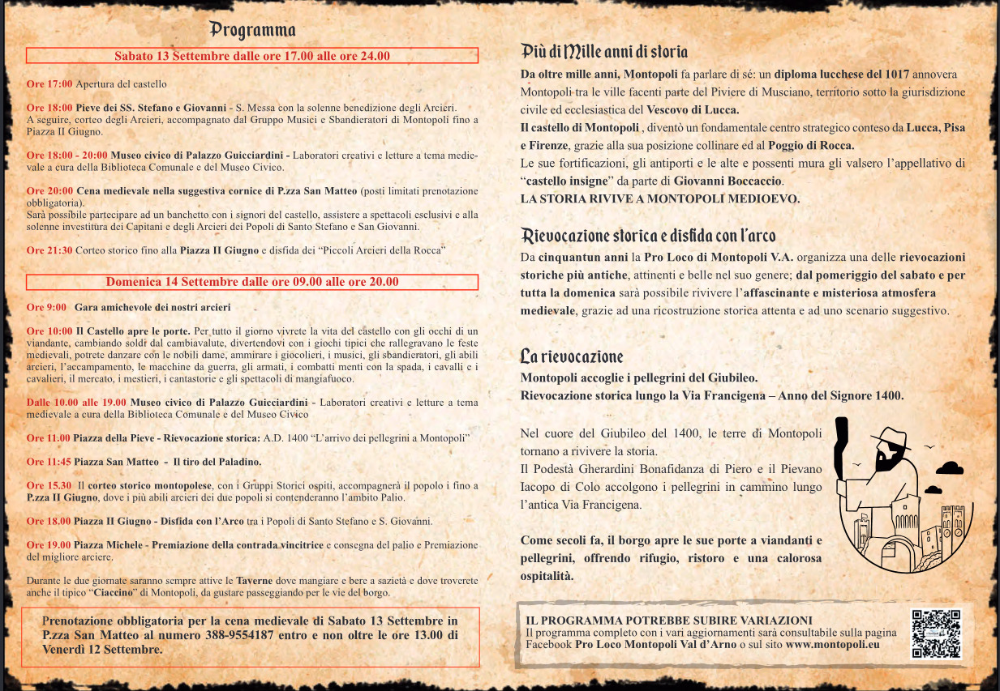

## PROGRAMMA COMPLETO

### Sabato 13

- **17:00** Partenza corteo storico
- **17:30** Piazza della Pieve - Esibizione Danza Storica Montopoli
- **17:45** Piazza Michele - Esibizione Gruppo Musici Montopoli
- **18:10** Piazza Michele - Combattimento armato a cura di Antichi Popoli
- **18:30** Piazza Michele - Spettacolo Compagnia del Grimorio
- **18:35** Piazza 2 Giugno - Dimostrazione di volo
- **18:40** Piazza Michele - Esibizione Lucuthea artisti di strada
- **19:15** Piazza 2 Giugno - Esibizione Gruppo Musici Montopoli
- **19:20** Piazza della Pieve - Esibizione Danza Storica Montopoli
- **19:50** Piazza Michele - Esibizione Lucuthea artisti di strada
- **20:00** Piazza S. Matteo - Cena Medievale
- **20:30** Piazza 2 Giugno - Spettacolo Compagnia del Grimorio
- **20:30** Piazza Michele - Spettacolo di fuoco Pyroetnico
- **21:00** Piazza della Pieve - Esibizione Danza Storica Montopoli
- **21:15** Partenza corteo
- **21:20** Piazza della Pieve - Combattimento armato a cura di Antichi Popoli
- **21:50** Piazza 2 Giugno - Esibizione gruppo storico di Pescia
- **22:00** Piazza Michele - Esibizione corteo storico di Pescia
- **22:00** Piazza 2 Giugno - Disfida con l’arco dei piccoli arcieri
- **22:20** Piazza della Pieve - Combattimento armato a cura di Antichi Popoli
- **22:30** Piazza Michele - Esibizione Lucuthea artisti di strada
- **23:00** Piazza Michele - Esibizione Danza Storica Montopoli
- **23:30** Piazza Michele - Spettacolo di fuoco Pyroetnico

---

### Domenica 14

- **10:00** Apertura borgo
- **10:00** Partenza Corteo Storico
- **10:40** Piazza della Pieve - Esibizione Danza Storica Montopoli
- **11:00** Piazza della Pieve - Rievocazione arrivo dei pellegrini
- **11:05** Piazza 2 Giugno - Esibizione Gruppo storico San Quirico d’Orcia
- **11:05** Piazza San Matteo - Esibizione Gruppo storico Cortona
- **11:10** Via del Falcone - Spettacolo teatrale associazione Elicriso
- **11:10** Piazza Michele - Esibizione Gruppo Storico Terra del Sole
- **11:15** Piazza 2 Giugno - Esibizione Gruppo Storico Calvi dell’Umbria
- **11:15** Piazza San Matteo - Esibizione Gruppo storico Vetralla
- **11:20** Piazza Michele - Esibizione Gruppo Storico Montopoli
- **11:30** Piazza della Pieve - Combattimento armato Antichi Popoli
- **11:35** Piazza 2 Giugno - Esibizione Lucuthea artisti di strada
- **11:45** Piazza San Matteo - Tiro del Paladino
- **11:50** Piazza Michele - Esibizione Giullari del Diavolo
- **11:55** Piazza della Pieve - Esibizione musici Gandalus
- **12:00** Piazza 2 Giugno - Esibizione ass. Chicchi d’Uva aps
- **12:10** Piazza della Pieve - Esibizione Danza Storica Montopoli
- **12:15** Piazza Michele - Esibizione Gruppo Storico Montopoli
- **12:30** Piazza San Matteo - Dimostrazione di volo
- **14:30** Piazza Michele - Esibizione Lucuthea artisti di strada
- **15:15** Piazza della Pieve - Combattimento armato Antichi Popoli
- **15:30** Piazza 2 Giugno - Esibizione Giullari del Diavolo
- **15:30** Partenza Corteo Storico
- **16:00** Piazza 2 Giugno - Esibizione musici Gandalus
- **16:10** Piazza Michele - Esibizione Gruppo Storico Vetralla
- **16:15** Piazza San Matteo - Esibizione Gruppo Storico Cortona
- **16:20** Piazza San Matteo - Esibizione Gruppo Storico Calvi dell’Umbria
- **16:30** Via del Falcone - Spettacolo teatrale associazione Elicriso
- **16:40** Piazza della Pieve - Esibizione ass. Chicchi d’Uva aps
- **16:50** Piazza Michele - Esibizione Gruppo Storico S. Quirico d’Orcia
- **16:55** Piazza 2 Giugno - Esibizione Gruppo Storico Montopoli
- **16:55** Piazza Michele - Esibizione Gruppo Storico Terra del Sole
- **17:10** Piazza San Matteo - Esibizione Lucuthea artisti di strada
- **17:20** Piazza Michele - Dimostrazione di volo
- **17:40** Piazza della Pieve - Combattimento armato Antichi Popoli
- **17:45** Piazza San Matteo - Esibizione musici Gandalus
- **17:50** Piazza 2 Giugno - Esibizione Danza Storica Montopoli
- **18:00** Piazza 2 Giugno - Inizio Disfida con l’Arco
- **18:00** Via del Falcone - Spettacolo teatrale associazione Elicriso
- **18:20** Piazza della Pieve - Esibizione Danza Storica Montopoli
- **18:30** Piazza San Matteo - Esibizione musici Gandalus
- **18:45** Piazza Michele - Combattimento armato Antichi Popoli
- **19:15** Piazza Michele - Proclamazione contrada vincitrice del Palio
- **19:30** Piazza Michele - Esibizione Giullari del Diavolo

---

---

 

---
