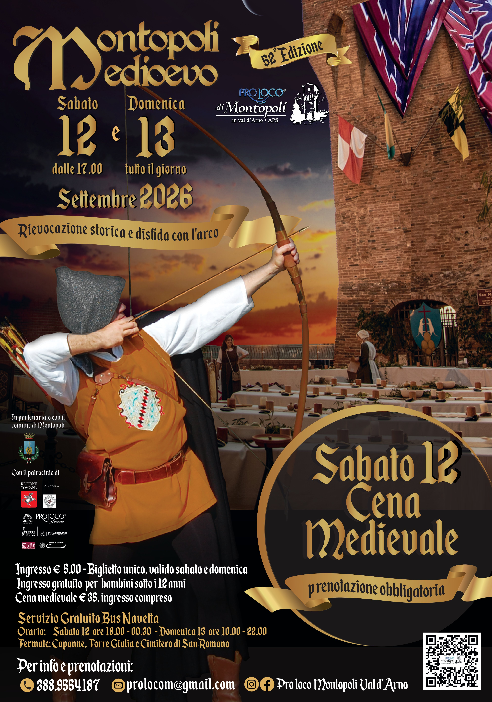

## PROGRAMMA

### Sabato 12 Settembre

- **17:00** Apertura del castello
- **18:00** Pieve dei SS. Stefano e Giovanni - S. Messa con la solenne benedizione degli Arcieri. A seguire, corteo degli Arcieri, accompagnato dal Gruppo Musici e Sbandieratori di Montopoli fino a Piazza II Giugno
- **20:00** Cena medievale nella suggestiva cornice di Piazza San Matteo (posti limitati prenotazione obbligatoria). Sarà possibile partecipare ad un banchetto con i signori del castello, assistere a spettacoli esclusivi  e alla solenne investitura dei Capitani e degli Arcieri dei Popoli di Santo Stefano e San Giovanni
- **21:30** Corteo storico del gruppo musici della contrada Samo di Fucecchio (FI), fino alla Piazza II Giugno e disfida dei “Piccoli Arcieri della Rocca”

---

### Domenica 13 Settembre

- **09:00** Gara amichevole dei nostri arcieri all'interno del centro storico
- **10:00** Il Castello apre le porte. Per tutto il giorno vivrete la vita del castello con gli occhi di un viandante, cambiando soldi dal cambiavalute, divertendovi con i giochi tipici che rallegravano le feste medievali, potrete danzare con le nobili dame, ammirare i giocolieri, i musici, gli - sbandieratori, gli abili arcieri, l’accampamento, le macchine da guerra, gli armati, i combattimenti con la spada, i cavalli e i cavalieri, il mercato, i mestieri, i cantastorie e gli spettacoli di mangiafuoco 
- **11:00** Piazza della Pieve- Rievocazione storica: “A.D. 1483 - Il Vescovo di Lucca assegna alla famiglia Lippi Porzi il patronato della Chiesa di San Jacopo in Monte”
- **11:45** Piazza S.Matteo – Palio dell’assalto al castello
- **15:30** Il corteo storico montopolese, con i Gruppi Storici ospiti di: Assisi (PG), Giove (TR), Lavagna (GE), Montevarchi (AR), San Gemini (TR) e Volterra (PI), accompagnerà il popolo fino a P.zza II Giugno, dove i più abili arcieri dei due popoli si contenderanno l’ambito Palio
- **18:00** P.zza II Giugno - Disfida con l’Arco tra i Popoli di Santo Stefano e S. Giovanni
- **19:00** P.zza Michele da Montopoli - Proclamazione della Contrada vincitrice, consegna del Palio e premiazione del miglior Arciere 2026
---
- **Il Programma dettagliato sarà aggiornato nei prossimi giorni**
---

- **Esposizione in Santa Marta (via del Falcone) 🎨 Mostra "Tradizioni con gli occhi dei bambini"** Venite a scoprire i disegni realizzati dai bambini dell’asilo e delle scuole elementari del comune di Montopoli! Una raccolta dei lavori nati dopo gli incontri svolti in classe con i **Musici, Sbandieratori e Arcieri**, che hanno raccontato e mostrato ai più piccoli l'arte delle loro discipline. 

---
- **Museo Civico Palazzo Guicciardini**
---
  **Sabato 12:** Museo aperto dalle 16 alle 19
---

---
