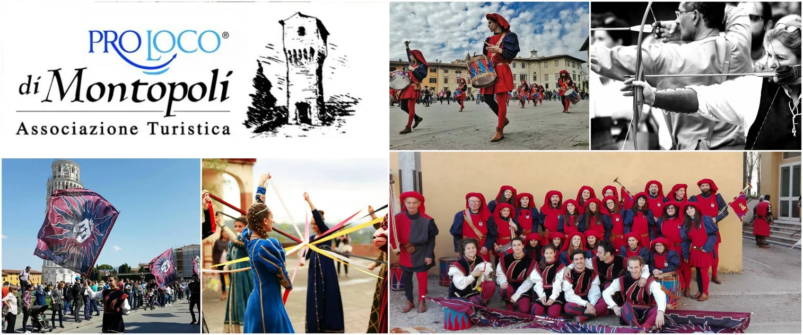

---

- La Danza Storica

- Il Gruppo Musici

- Il Gruppo Sbandieratori

- Gli Arcieri

---

La Danza Storica è il primo gruppo nato all’interno della Pro Loco, fondato proprio nel 1976 da alcune ragazze del paese appassionate di danza e di musica medievale e rinascimentale. Nel corso degli anni le nuove generazioni si sono via via perfezionate nello studio delle tecniche della danza rinascimentale, studiando i trattati e frequentando corsi con i più importanti maestri del settore. Il Gruppo Danza Storica di Montopoli si è esibito fin dagli anni settanta, in antichi borghi, castelli, piazze e palazzi sia in Italia che all’estero, San Marino in occasione delle Giornate Medievali, Firenze, Prato, Lucca, Pisa, Volterra, Gubbio, Massa Marittima, Orthez (Francia), Sant’Elpidio a Mare, Agrigento, Iglesias, Fiuggi, Carovigno, Canossa, Valbonne (Francia)…., in più occasioni è stato ripreso anche dalla RAI e altre emittenti televisive, ottenendo successi e numerosi riconoscimenti. Le dame della danza storica rievocano le danze del Quattrocento (Balli e Basse Danze) e del Cinquecento, con coreografie tratte e ricostruite grazie allo studio dei trattati dei più importanti maestri di ballo dell’epoca, e sono in grado di ricreare la suggestiva atmosfera del periodo rinascimentale. Si esibiscono anche in danze su musiche trecentesche con passi tratti dall’iconografia.

Il Gruppo Musici è composto da tamburi, flauti e chiarine. Con il rullare dei loro tamburi, il suono armonioso dei flauti e gli squilli delle chiarine sono in grado di accompagnare ogni tipo di corteo storico e sono molto apprezzati per i loro particolari giochi e movimenti di parata

Il Gruppo Sbandieratori è il gruppo più giovane, è stato ricostituito a Settembre 2018 con una nuova giovane formazione. Portano gioia al gruppo intero con il volteggiare delle loro bandiere al tempo e ritmo dei nostri musici.

Gli arcieri della Pro Loco durante gli spettacoli folkloristici danno il meglio di loro stessi, esibendosi in evoluzioni e tiri di abilità e di destrezza. Sono i protagonisti della Disfida con l’Arco.
