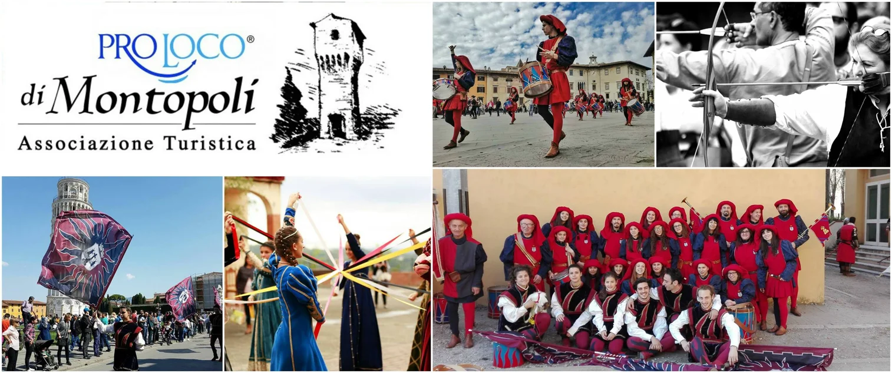

---

- La Danza Storica

- Il Gruppo Musici

- Il Gruppo Sbandieratori

- Gli Arcieri

---

## Un po’ di storia…

Il Gruppo Storico montopolese nasce nel 1976 con lo scopo di avvicinare i giovani alla cultura medievale e rinascimentale della loro terra di cui Montopoli fu Castello Insigne. Il gruppo storico è suddiviso in: Arcieri della Rocca, Musici, Sbandieratori e Danza Storica. Nel corso degli anni, questo gruppo, è riuscito a farsi apprezzare sia in Italia che all'estero esibendosi in città come Pisa, Volterra, Firenze, Gubbio, San Marino, Ortez, Maussanne les Alpilles (entrambe in Francia).

### Gli arcieri

Gli arcieri della Pro Loco sono i protagonisti della disfida con l’ arco, che viene organizzata durante la rievocazione storica Montopoli Medioevo giunta oggi alla sua cinquantesima edizione.

### I Musici

I Musici con il rullare dei loro tamburi, il suono armonioso dei flauti e gli squilli delle chiarine sono in grado di accompagnare ogni tipo di corteo storico e sono molto apprezzati per i loro particolari giochi e movimenti di parata. Il Gruppo Musici è associato alla Federazione Italiana Giochi Storici (F.I.G.S.)

### Gli Sbandieratori

Dal 2010, il Gruppo Sbandieratori, entra a far parte del gruppo storico. Nella storia, la figura dello sbandieratore, era molto importante: essi portavano i vessilli delle loro casate e proprio queste bandiere erano motivo d'orgoglio. Erano indicatori fondamentali in battaglia. Oggi gli sbandieratori portano la bandiera e gli stemmi delle proprie città tra volteggi, lanci e coreografie ritmiche

### La Danza Storica

Il gruppo della Danza Storica è composto da circa 15 ragazze che si esibiscono in coreografie e passi ricostruiti grazie all ´iconografia e allo studio dei Trattati di danza del 1400 e del 1500. Il loro repertorio abbraccia il periodo storico compreso tra il 1300 ed il 1500. Con la loro eleganza, volontà e passione ottengono ovunque lusinghieri successi, facendo rivivere agli spettatori lo sfarzo e la bellezza delle corti europee dell´epoca.

La Danza Storica è il primo gruppo nato all’interno della Pro Loco, fondato proprio nel 1976 da alcune ragazze del paese appassionate di danza e di musica medievale e rinascimentale. Nel corso degli anni le nuove generazioni si sono via via perfezionate nello studio delle tecniche della danza rinascimentale, studiando i trattati e frequentando corsi con i più importanti maestri del settore. Il Gruppo Danza Storica di Montopoli si è esibito fin dagli anni settanta, in antichi borghi, castelli, piazze e palazzi sia in Italia che all’estero, San Marino in occasione delle Giornate Medievali, Firenze, Prato, Lucca, Pisa, Volterra, Gubbio, Massa Marittima, Orthez (Francia), Sant’Elpidio a Mare, Agrigento, Iglesias, Fiuggi, Carovigno, Canossa, Valbonne (Francia)…., in più occasioni è stato ripreso anche dalla RAI e altre emittenti televisive, ottenendo successi e numerosi riconoscimenti. Le dame della danza storica rievocano le danze del Quattrocento (Balli e Basse Danze) e del Cinquecento, con coreografie tratte e ricostruite grazie allo studio dei trattati dei più importanti maestri di ballo dell’epoca, e sono in grado di ricreare la suggestiva atmosfera del periodo rinascimentale. Si esibiscono anche in danze su musiche trecentesche con passi tratti dall’iconografia.
