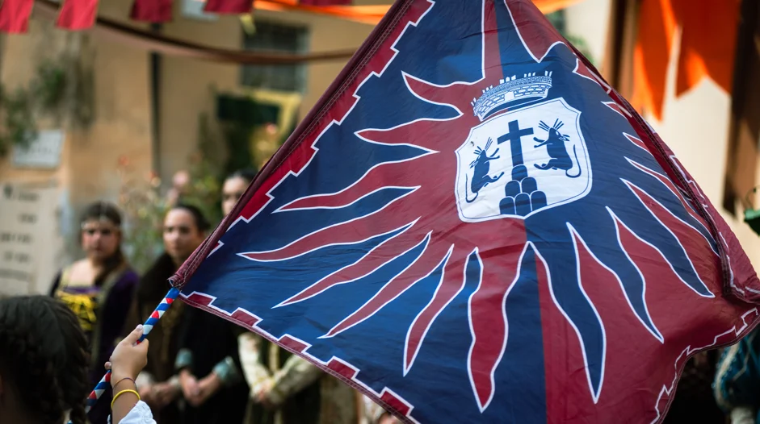
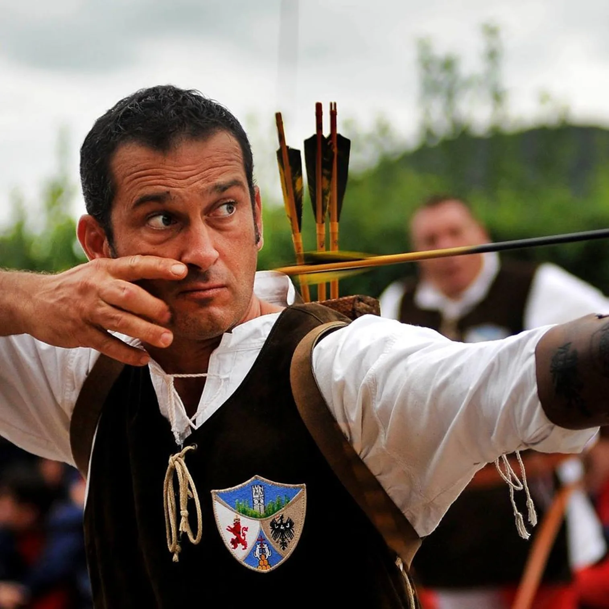

La manifestazione storica "Montopoli Medioevo – Rievocazione storica e Disfida con l'arco" rievoca il periodo storico del Basso Medioevo e si svolge a Montopoli, una cittadina originariamente divisa in due popoli nel 1412 dal Podesta' Jacopo degli Albizi (le contrade del “Perinsù” e “Peringiù”). La manifestazione coinvolge oltre 300 figuranti, sbandieratori, tamburini, chiarine, artisti di strada, arcieri, danzatrici storiche, cortei con gruppi storici provenienti da tutta la Toscana e anche da fuori regione. Tutti i costumi, le armi e i manufatti utilizzati durante la manifestazione sono frutto di ricerche e approfondimenti su raffigurazioni pittoriche relative al periodo del Basso Medioevo.

Ogni anno, il tema della rievocazione storica varia, e vengono rievocati specifici eventi accaduti nel periodo storico di riferimento, dalla Pace di Montopoli alla visita di Machiavelli.

Da oltre mille anni, Montopoli fa parlare di sé: un diploma lucchese del 1017 annovera Montopoli tra le ville facenti parte del Piviere di Musciano, territorio sotto la giurisdizione civile ed ecclesiastica del Vescovo di Lucca. Il castello di Montopoli, diventò un fondamentale centro strategico conteso da Lucca, Pisa e Firenze, grazie alla sua posizione collinare ed al Poggio di Rocca.

Le sue fortificazioni, gli antiporti e le alte e possenti mura gli valsero l’appellativo di “castello insigne” da parte di Giovanni Boccaccio.

## La rievocazione storica e la disfida con l'arco

Da 50 anni la Pro Loco di Montopoli V.A. organizza una delle rievocazioni storiche più antiche, attinenti e belle nel suo genere; dal pomeriggio del Sabato e per tutta la Domenica sarà possibile rivivere l’affascinante e misteriosa atmosfera medievale, grazie ad una ricostruzione storica attenta e ad uno scenario suggestivo; le giornate di festa avranno il loro culmine la Domenica con la Disfida con l’arco tra la Contrada di Santo Stefano (Perinsù – colori bianco e rosso) e la Contrada di San Giovanni (Peringiù -colori giallo e nero); i due Popoli in cui fu divisa la comunità dal Podestà Jacopo degli Albizi.

## Tema 2025

Montopoli accoglie i pellegrini del Giubileo.
Rievocazione storica lungo la Via Francigena – Anno del Signore 1400

Nel cuore del Giubileo del 1400, le terre di Montopoli tornano a rivivere la storia.

Il Podestà Gherardini Bonafidanza di Piero e il Pievano Iacopo di Colo accolgono i pellegrini in cammino lungo l’antica Via Francigena.

Come secoli fa, il borgo apre le sue porte a viandanti e pellegrini, offrendo rifugio, ristoro e una calorosa ospitalità.

